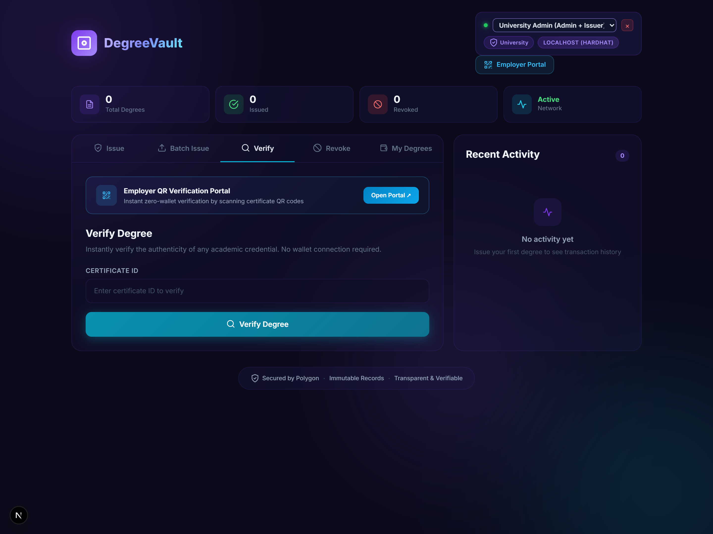
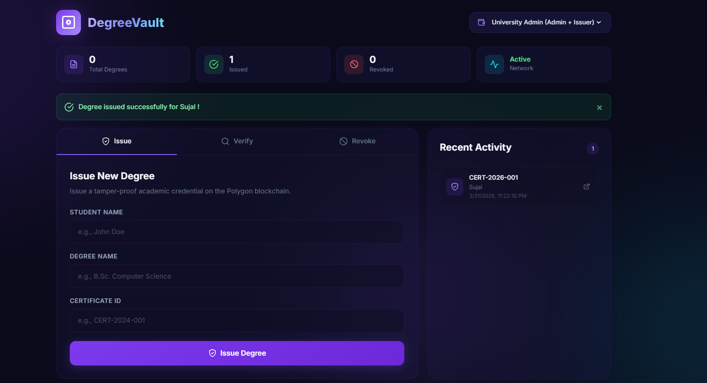
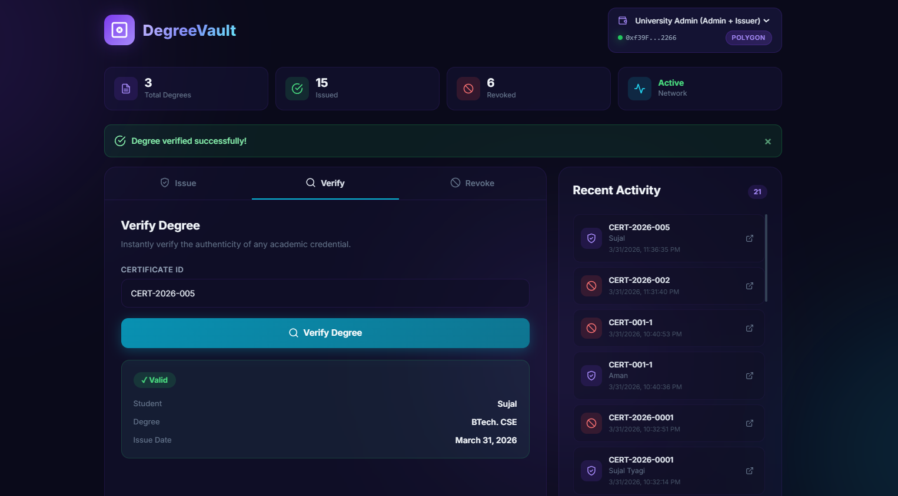
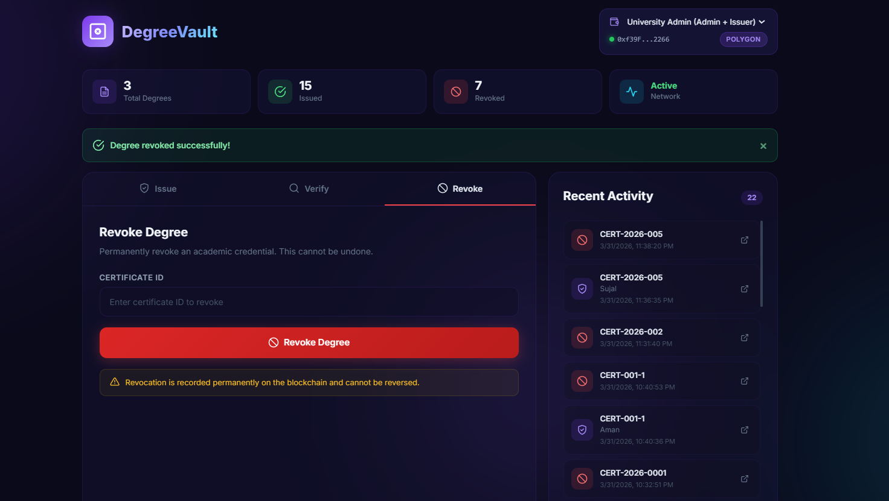
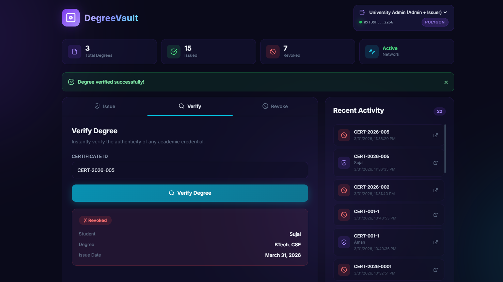
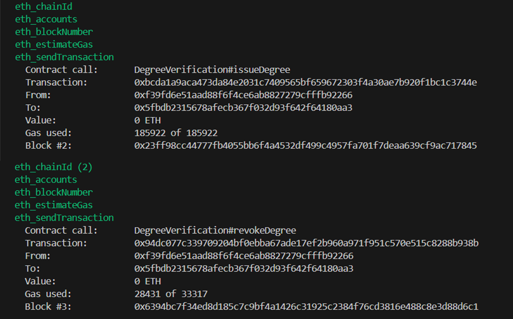

# 🎓 DegreeVault - Degree Verification System
<div align="center">
  
  
  
  
</div>
<br/>

**DegreeVault** is a production-grade, blockchain-based degree verification system built with Solidity, Hardhat, and Next.js. This decentralized application (dApp) enables academic institutions to issue, verify, and revoke academic credentials in a transparent, secure, and immutable manner — seamlessly deployed on the **Polygon** network for high performance and low gas fees.

## 📋 Table of Contents

- [Visual Previews & Demo Narrative](#visual-previews)
- [Why Blockchain? (Architecture & Trade-offs)](#why-blockchain)
- [Features](#features)
- [Tech Stack](#tech-stack)
- [Advanced Smart Contract Architecture](#advanced-smart-contract-architecture)
- [Security Design](#security-design)
- [Prerequisites](#prerequisites)
- [Installation & Setup](#installation)
- [Step-by-Step Usage](#usage)
- [Testing](#testing)
- [Production & Testnet Deployment](#deployment)
- [Project Structure](#project-structure)
- [Contributing Guidelines](#contributing)
- [Authors & Ownership](#authors)
- [License](#license)


<a id="visual-previews"></a>
## 📸 Visual Previews & Demo Narrative

This section demonstrates the complete lifecycle of the DegreeVault system: from issuing a credential to public verification and authorized revocation.

### 1. The Admin Dashboard (Overview)
A high-level view providing real-time analytics on total degrees issued, verified, and revoked. Includes quick access to core functionalities.

<div align="center">
  <br/>
</div>
<br/>

### 2. Issue Degree (Issuance Lifecycle)
The university issues a digital credential by entering student details and a unique cryptographic certificate ID. The transaction is instantly recorded on the Polygon network.

<div align="center">
  <br/>
</div>
<br/>

### 3. Verify Degree (Public Verification)
Anyone (e.g., employers) can publicly verify a credential by looking up its unique ID. The system queries the blockchain and confirms the exact state transitioning (Valid).

<div align="center">
  <br/>
</div>
<br/>

### 4. Revoke Degree (Administrative Revocation)
An authorized university role can revoke a credential if needed (e.g., due to student expulsion or error). This triggers a state transition but ensures historical data immutability.

<div align="center">
  <br/>
</div>
<br/>

### 5. Post-Revocation Verification
Once revoked, the degree remains on-chain. When queried, DegreeVault identifies the document as an authentic record that has since been marked **Invalid** by the issuer, ensuring full auditability.

<div align="center">
  <br/>
</div>
<br/>

### 6. Blockchain Transaction Logs (Backend Execution)
Real-time blockchain interactions, including contract calls and transaction validation executing on the active RPC node.

<div align="center">
  <br/>
</div>

---
## ❗ Problem Statement

Traditional degree verification systems are:
- Slow and manual
- Vulnerable to forgery
- Dependent on centralized authorities

DegreeVault solves this using a decentralized, tamper-proof verification system built on blockchain.

<a id="why-blockchain"></a>
## ⚖️ Why Blockchain? (Architecture & Trade-offs)

DegreeVault is implemented on EVM-compatible networks (Polygon natively) after deeply evaluating core requirements across trust, transparency, cost, and performance.

### 🔐 Trust vs. Centralization
- **Traditional DB Systems**: Rely heavily on centralized, mutable servers owned by third-party verification agencies. Single points of failure.
- **DegreeVault (Blockchain)**: Smart contracts enforce logic autonomously. The decentralized ledger guarantees a trustless verification model—no human intervention can alter the verified truth.

### 🔍 Unparalleled Transparency & Immutable Audit Logs
- All degree issuance and revocation events are recorded dynamically on-chain.
- The state history is preserved forever, ensuring an irrefutable audit trail that anyone can inspect without centralized permission.

### 💰 Cost vs. Performance Trade-off
Traditional databases are faster and cheaper per write. Blockchain introduces network interaction latency and gas costs. 
- **Optimization**: To balance this, DegreeVault stores *only* the **SHA-256 cryptographic hash** of the certificate details on-chain alongside metadata, rather than heavy JSON artifacts.
- **Ecosystem**: Deployed selectively to **Polygon** to reduce costs by 99% compared to Ethereum L1, yielding near-instant settlement.

---

<a id="features"></a>
## ✨ Features

### Smart Contract Layer
- **Issue Degrees**: Authorized universities issue academic credentials anchored to unique IDs as non-transferable Soulbound Tokens (SBTs).
- **Batch Degree Issuance**: Mint multiple credentials in a single on-chain transaction to optimize gas costs.
- **Verify Degrees**: Trustless, public verification mechanism validating cryptographic hashes and issuer signatures.
- **Revoke Degrees with Guardrails**: Secure revocation that triggers state changes without erasing immutable history, backed by UI confirmation dialogs.
- **Role-Based Access Control (RBAC)**: Strict OpenZeppelin `AccessControl` (`DEFAULT_ADMIN_ROLE`, `UNIVERSITY_ROLE`) preventing unauthorized contract manipulation.
- **Event Logging**: Transparent, structured event emissions (`DegreeIssued`, `DegreeRevoked`) mapping every architectural action.

### DApp Frontend Layer
- **MetaMask Wallet Integration (EIP-1193)**: Native Web3 wallet connection with live account (`accountsChanged`) and chain (`chainChanged`) event listeners.
- **Dynamic Role-Based Access Control UI**: Real-time role detection displaying admin tabs (**Issue**, **Batch Issue**, **Revoke**) for verified universities, and placing unauthorized wallets in read-only **Verifier Mode**.
- **Network Validation & 1-Click Switcher**: Detects unsupported networks (e.g. Ethereum Mainnet `0x1`) and prompts 1-click automatic switching (`wallet_switchEthereumChain`) to Localhost (`31337`) or Polygon Amoy (`80002`).
- **High-Error-Correction QR Code System**: Generates Level-H QR codes for every issued degree, featuring 1-click PNG image download and direct clipboard URL copying.
- **Dedicated Zero-Wallet Employer Portal (`/verify?cert=...`)**: Employers and recruiters can scan QR codes to instantly verify credentials on-chain via read-only RPC—no MetaMask, wallet connection, or cryptocurrency required.
- **Batch CSV Import & Preview**: Upload `.csv` files and inspect student records in an interactive table before batch-minting on-chain.
- **"My Degrees" Student Portfolio**: Connected student wallets view their personal Soulbound Token credentials and real-time status.
- **Real-Time Transaction Lifecycle**: Multi-state transaction card (`AWAITING_SIGNATURE` → `PENDING` → `CONFIRMED` / `FAILED`) with mined block numbers and explorer links.

<a id="tech-stack"></a>
## 🛠️ Tech Stack

- **Blockchain**: Polygon (Amoy Testnet `80002` / Mainnet `137`), Hardhat Local (`31337`)
- **Smart Contracts**: Solidity `^0.8.20`
- **Security Standards**: OpenZeppelin Contracts v5 (`AccessControl`, `ERC721`)
- **Frontend App**: Next.js 14 App Router (TypeScript)
- **Styling**: Tailwind CSS
- **Web3 Interface**: ethers.js v6 (`BrowserProvider` for signing, `JsonRpcProvider` for zero-wallet queries)
- **QR Code Engine**: `qrcode` (Level-H high-error-correction canvas & data URL renderer)
- **Test Framework**: Hardhat Chai Matchers, Playwright browser test suite
- **Local Dev**: Hardhat Local Network (`http://127.0.0.1:8545`)

---

<a id="advanced-smart-contract-architecture"></a>
## 🔒 Advanced Smart Contract Architecture

The main contract `DegreeVerification.sol` manages credentials through a secure state-driven lifecycle. Here is the rationale behind the technical decisions:

### 🛡️ Role-Based Access Control (RBAC)
- Implemented using OpenZeppelin's `AccessControl`.
- **Reasoning**: Creates zero-trust execution. `UNIVERSITY_ROLE` handles issuance/revocation, while `DEFAULT_ADMIN_ROLE` handles superuser management. This cleanly minimizes the attack surface against unauthorized writes.

### 🧾 Immutable State Transitions
- Rather than mapping certificates to simple booleans, they transition between `Valid` and `Revoked`.
- **Reasoning**: True auditing requires history. Deleting a struct violates the blockchain design pattern.

### 🔑 Hash-Based Storage Model
- The protocol acts purely as an anchor. It logs the `bytes32 certificateHash` of the actual data off-chain.
- **Reasoning**: Direct string or document storage costs exorbitant gas. Hashing guarantees document integrity off-chain while maintaining a minimal, cheap on-chain footprint. Protects student privacy explicitly.

### 📡 Event-Driven Integration
- `DegreeIssued` and `DegreeRevoked` events are consistently emitted.
- **Reasoning**: Enables dynamic indexing by graphs (like The Graph) and allows lightweight frontend RPC polling without iterating iteratively through contract state mappings.

---

<a id="security-design"></a>
## 🔏 Security Design & Considerations

- **Attack Surface Minimization**: Strict visibility modifiers (`external`, `private`) strictly scope logic limits.
- **Duplicate Issuance Prevention**: `require()` flags ensure a specific hash identifier cannot be minted twice, preventing replay issuance.
- **Integrity through Cryptography**: Mapping inputs to `bytes32` hashes acts as a proof-of-knowledge. Even a compromised backend cannot forge an invalid credential if the blockchain hash does not correspond.
- **Library Reliance**: We lean entirely on audited OpenZeppelin standard libraries over writing bespoke security wrappers.

---

<a id="prerequisites"></a>
## 📦 Prerequisites

1. **Node.js** (v18+ recommended)
2. **Git**
3. **MetaMask** Browser Extension (or compatible Web3 Wallet)
4. A code editor (e.g., VS Code)

---

<a id="installation"></a>
## 🚀 Installation & Setup

### 1. Clone the Repository
```bash
git clone https://github.com/innovation-space/course-project-submission-proofoftrust.git
cd course-project-submission-proofoftrust
```

### 2. Install Smart Contract Dependencies
```bash
npm install
```

### 3. Install Frontend Dependencies
```bash
cd frontend
npm install
cd ..
```

### 4. Configure Environment Variables
Copy the `.env.example` to `.env` in the root folder, and fill in your keys. This is critical for connecting to live infrastructure without leaking private data:

```env
# Example .env File Structure
POLYGON_AMOY_RPC_URL="https://rpc-amoy.polygon.technology"
POLYGON_MAINNET_RPC_URL="https://polygon-rpc.com"
PRIVATE_KEY="YOUR_METAMASK_PRIVATE_KEY"
```
*(Make sure `.env` is listed in your `.gitignore`!)*

---

<a id="usage"></a>
## 💻 Step-by-Step Usage & API Flow

### Step 1: Start the Local Hardhat Node
Provide a local blockchain with 20 pre-funded test accounts:
```bash
npx hardhat node
```

### Step 2: Deploy Contract Locally
In a separate terminal, deploy to the local network:
```bash
npx hardhat run scripts/deploy.js --network localhost
```
*Copy the resulting contract address and map it in `frontend/app/page.tsx`.*

### Step 3: Start the Next.js Frontend
```bash
cd frontend
npm run dev
```
Accessible at `http://localhost:3000`. 

### Step 4: Interact via Wallet & Zero-Wallet Verification
- **Issue Single / Batch**: Connect an account granted `UNIVERSITY_ROLE`. Enter student details (or upload a `.csv`) to mint on-chain credentials as Soulbound NFTs.
- **QR Code Generation**: Once issued, DegreeVault automatically displays a Level-H QR code linking directly to `http://localhost:3000/verify?cert=<CERT_ID>`. You can download the PNG asset or copy the verification link.
- **In-App & Public Verification (Zero Wallet Required)**:
  - **In-App**: Anyone can query certificate status via the **Verify** tab.
  - **Employer QR Portal**: Employers scan the QR code to open `/verify?cert=...`. The system fetches on-chain status immediately via RPC without requiring any MetaMask wallet or cryptocurrency.
- **Revoke**: Authorized university accounts can revoke compromised or mistakenly issued credentials with a confirmation safety prompt. Mined immediately and reflected across all verification portals in real time.

---

<a id="testing"></a>
## 🧪 Testing

The codebase includes comprehensive chai tests analyzing smart contract edge cases, role assertions, and state verification.

```bash
# Run unit tests
npx hardhat test

# Run tests with active gas benchmarking/reporting
REPORT_GAS=true npx hardhat test
```

---

<a id="deployment"></a>
## 🌐 Production & Testnet Deployment

We structure the system for a production narrative aimed at Polygon.

### 1. Polygon Amoy Testnet (Staging)
Secure test MATIC from the official faucet. Hook up the `POLYGON_AMOY_RPC_URL`.
```bash
npx hardhat run scripts/deploy.js --network amoy
```

### 2. Polygon Mainnet (Production)
For definitive live deployments. Requires accurate gas configurations.
```bash
npx hardhat run scripts/deploy.js --network polygon
```
After deployment, configure the target chain and updated contract address parameters directly into the DApp frontend variables to flip environments.

---

<a id="project-structure"></a>
## 📁 Project Structure

```
DegreeVault/
├── contracts/
│   └── DegreeVerification.sol    # Soulbound ERC721 & AccessControl smart contract
├── scripts/
│   ├── deploy.js                 # Network-aware deployment script
│   └── check-transactions.js     # Transaction validation script
├── test/
│   └── DegreeVerification.test.js# 32 Hardhat integration tests
├── frontend/
│   ├── app/                      
│   │   ├── page.tsx              # Main dApp dashboard & tab router
│   │   ├── globals.css           # Design tokens & glassmorphism styling
│   │   ├── verify/
│   │   │   └── page.tsx          # Dedicated Zero-Wallet Employer Portal
│   │   └── lib/
│   │       ├── wallet.ts         # MetaMask provider & account state
│   │       ├── network.ts        # Chain validation & 1-click switcher
│   │       ├── qrcode.ts         # Level-H QR code generation & PNG export
│   │       └── contract.ts       # Contract ABI, types & RPC helpers
│   └── package.json
├── hardhat.config.js             # Hardhat network & compiler configuration
├── .env.example                  # Environmental security template
├── .gitignore                    # Production git exclusion rules
└── README.md
```

---

<a id="contributing"></a>
## 🤝 Contributing Guidelines

We believe in open innovation. Contributions are highly welcome!

**Contribution Workflow:**
1. Fork the Project Repository.
2. Create your Feature Branch: `git checkout -b feature/AmazingFeature`
3. Commit your Changes: `git commit -m 'feat: Add some AmazingFeature'`
4. Push to the Branch: `git push origin feature/AmazingFeature`
5. Open a formal Pull Request documenting your architecture or UI changes.

Make sure tests pass fully (`npx hardhat test`) before opening a PR.

---

<a id="authors"></a>
## 👥 Authors & Ownership

Developed and conceptually driven by:
- **Sujal Tyagi** 
- **Amil Mahajan** 


---

<a id="license"></a>
## 📝 License

Distributed under the ISC License. 

---

**Built using Hardhat, Next.js & Polygon.**
